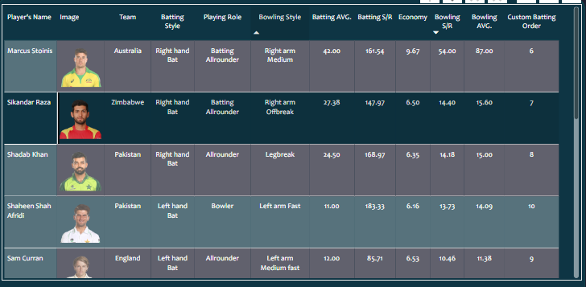

# Cricket 2022 World Cup Data Analytics Project

## Overview
This is an end-to-end data analytics project. In this project, we analyze cricket 2022 World Cup data (2022) to assemble the best 11 players team that could potentially play against aliens. The project involves web scraping, data cleaning, transformation, dashboard building, and insights extraction.

## Contents
- Problem Statement
- Requirement Scoping
- Data Collection Using Web Scraping from ESPN Cricinfo website (python and beatifulsoup )
- Data Cleaning and Transformation in Python Pandas
- Data Transformation in Power Query (file DAX Query.csv)
- Data Modeling and Building Parameters Using DAX
- Building Dashboard in Power BI
- Collecting Insights from the Dashboard and Selecting the Final 11 Players

## Description
In this project, we utilize Bright Data web scraping to collect cricket 2022 World Cup (2022) data from the ESPN Cricinfo website. We then perform data transformation and cleaning using Python Pandas. Next, we use Power Query for additional data transformation. Following that, we use DAX for data modeling and building parameters. Finally, we build a dashboard in Power BI to visualize the insights derived from the data.

This project serves as a solid data science resume project, which can significantly enhance your resume and make it stand out in the competition. It is a fully guided data analytics project with all the necessary materials included.
## Result
### Page 1

### Pages Navigation

### Page 2

### Page 3

### Last Page

## How to Use
1. Clone or download the project repository.
2. Install the required dependencies.
3. Follow the step-by-step guide provided in each section of the project.
4. Use the provided data and scripts to replicate the project on your own system.
5. Customize and modify the project as needed for your own learning or presentation purposes.

## Contributors
- [OUAKIB Amine]

## License
This project is licensed under the [OUAKIB Amine]. See the [LICENSE](LICENSE) file for details.
